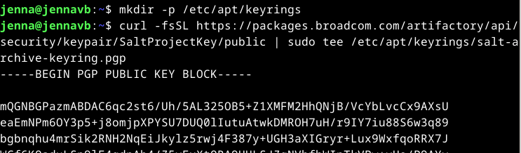
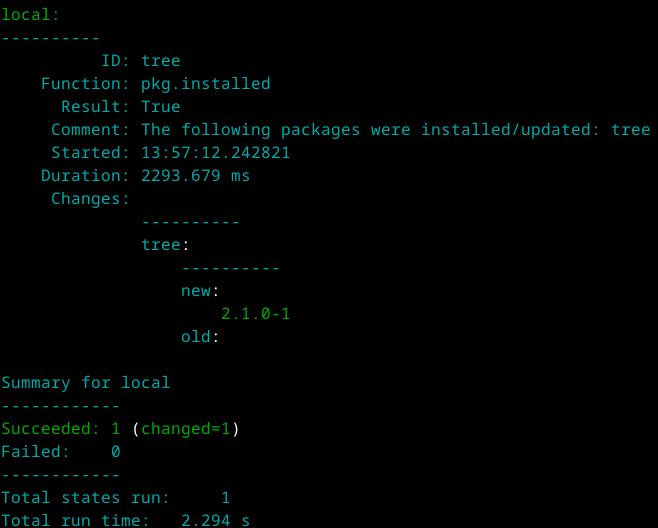
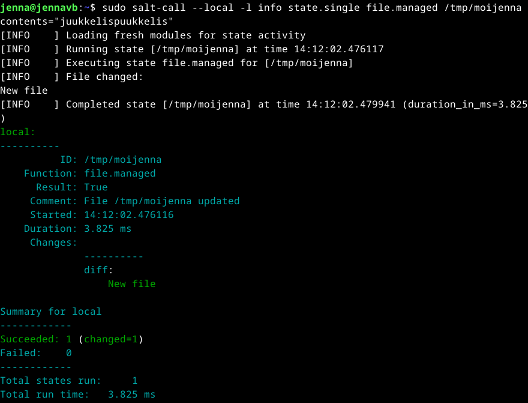
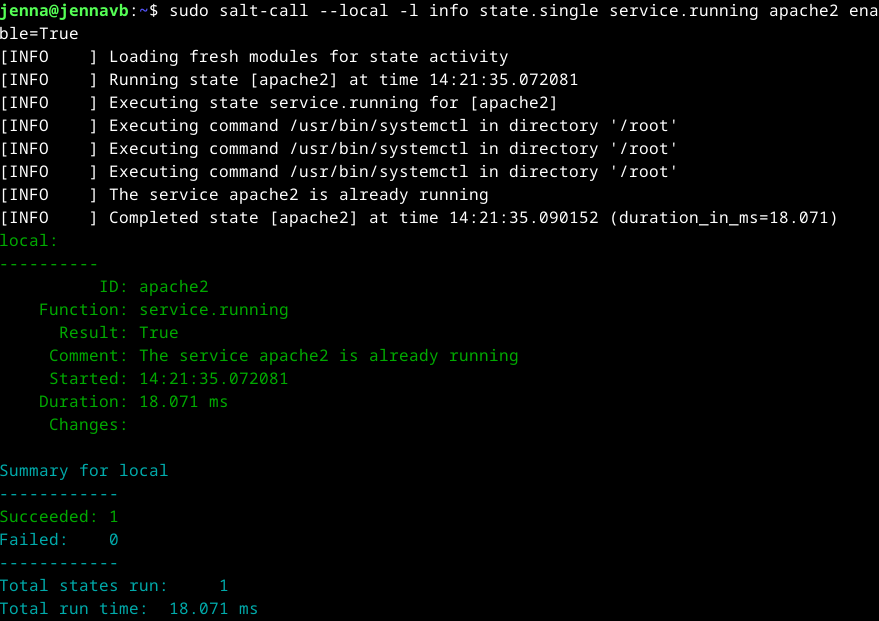
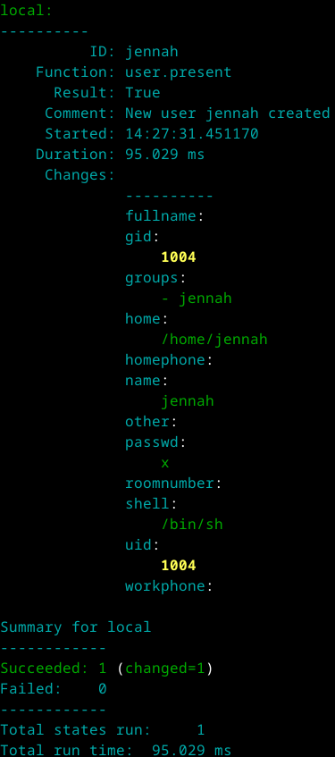
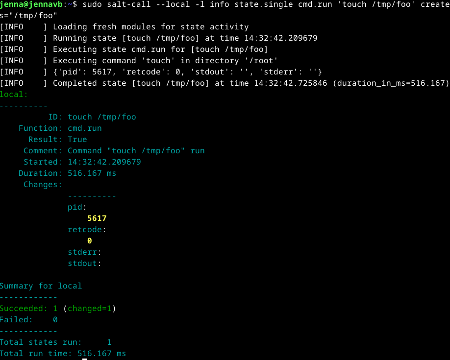
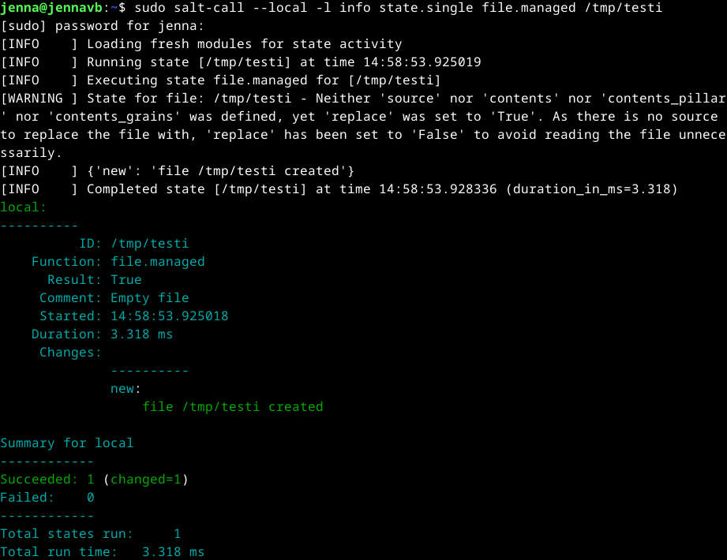
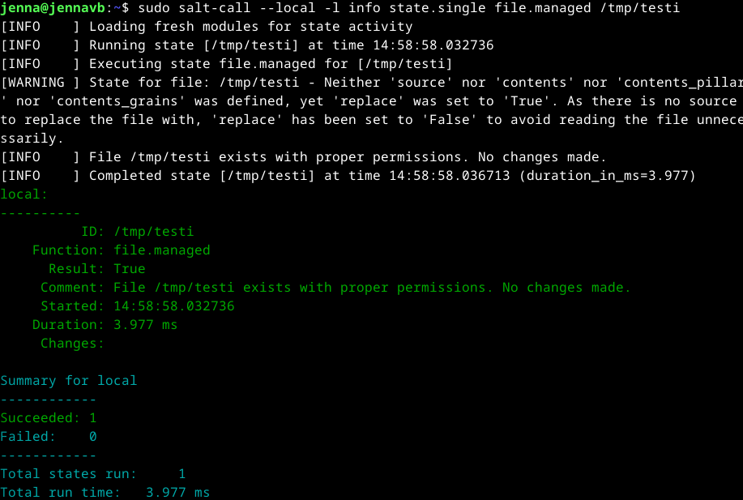

# Viisikko

## Tiivistelmät
**Run Salt Command Locally**
- Salt voidaan ajaa paikallisesti testiä ja pika-asetuksia varten
- asennus: `sudo apt-get -y install salt-minion`
- tärkeimmät tilafunktiot: `pkg`, `file`, `service`, `user`, `cmd`
  - **pkg:** pakettien asentaminen ja poistaminen
  - **file:** tiedostojen hallinta - asetukset ovat tekstitiedostoissa
  - **service:** palveluiden käynnistys ja pysäytys - `running` / `dead`
  - **user:** käyttäjätunnusten hallinta
  - **cmd:** komentojen suorittaminen
    - suositaan kuintenkin mahdollisuuksien mukaan `file`, `service` ja `user` -moduuleja
- ohjeita komennoista: `sudo salt-call --local sys.state_doc`

**Salt Quickstart – Salt Stack Master and Slave on Ubuntu Linux**
- Salt mahdollistaa tuhansien tietokoneiden hallinnan
- master-palvelin ohjaa Slave-minioneita, jotka voivat sijaita missä tahansa
- vain master tarvitsee tunnetun IP-osoitteen
- masterin asennus:
  - `master$ sudo apt-get -y install salt-master`
  - `master$ hostname -I` - IP-osoitteen selvitys
  - jos palomuuri käytössä, avaa portit `4505/tcp`ja `4506/tcp`
- slaven asennus:
  - `slave$ sudo apt-get -y install salt-minion`
  - masterin ip-osoitteen ja slaven nimen asetus:
    - `slave$ sudoedit /etc/salt/minion` -> esim: `master: 10.0.0.88` `id: tero`
    - `slave$ sudo systemctl restart salt-minion.service` - slaven uudelleenkäynnistys, jotta asetukset tulevat voimaan
- Slave-avaimen hyväksyminen Masterilla
  - `master$ sudo salt-key -A`
- Slaven testaus:
  - `master$ sudo salt '*' cmd.run 'whoami'` - tulokseksi tulisi saada slaven nimi/nimet

**Raportin kirjoittaminen**
- tekstin tulee olla täsmällinen sekä kertoa mitä on tehty, miten ja mikä on lopputulos
- helppolukuisuus sekä seurattavuus/toistettavuus on tärkeää, lukijan tulee pystyä seuraamaan sekä toistamaan toimenpiteet samalla lopputuloksella
- viittaa käytettyihin lähteisiin, älä plagioi
- raportin sepittäminen vie lukijan aikaa ja on kiellettyä

**Salt Install Guide: Linux (DEB)**
- keyrings polun luonti tai sen olemassaolon varmistus: `mkdir -p /etc/apt/keyrings`
- julkisen avaimen lataus: `curl -fsSL https://packages.broadcom.com/artifactory/api/security/keypair/SaltProjectKey/public | sudo tee /etc/apt/keyrings/salt-archive-keyring.pgp`
- apt repositorin konfiguraatiotiedosto: `curl -fsSL https://github.com/saltstack/salt-install-guide/releases/latest/download/salt.sources | sudo tee /etc/apt/sources.list.d/salt.sources`
- tämän jälkeen tulee muistaa päivittää metadata komennolla `sudo apt update`

## Tehtäviä
### Käyttöympäristö
Intel Core i7-13700K, 3.40 GHz, 16 Core Processor   
RAM: 32 Gt   
Windows 11 Pro, versio 23H2  
Debian 12 Bookworm

### Asenna Salt (salt-minion) Linuxille
Seurasin asennuksessa WMWare Inc [ohjeita](https://docs.saltproject.io/salt/install-guide/en/latest/topics/install-by-operating-system/linux-deb.html) ja aloitin luomalla polun komennolla `mkdir -p /etc/apt/keyrings`. Seuraavaksi latasin julkisen avaimen ja loin apt repon konfigurointitiedoston: 

    curl -fsSL https://packages.broadcom.com/artifactory/api/security/keypair/SaltProjectKey/public | sudo tee /etc/apt/keyrings/salt-archive-keyring.pgp
    curl -fsSL https://github.com/saltstack/salt-install-guide/releases/latest/download/salt.sources | sudo tee /etc/apt/sources.list.d/salt.sources

Sitten päivitin datan uudestaan komennolla `sudo apt-get update`.  
Seuraavaksi asensin Salt-minionin: `sudo apt-get -y install salt-minion`.  

### Viisi tärkeintä
**pkg**  
Aloitin syöttämällä komennon: `sudo salt-call --local -l info state.single pkg.installed tree`. Komento tarkistaa onko `tree` asennettuna, jos ei ole, se asentaa sen.  
Sama komento, mutta `pkg.removed` poistaa asennuksen.  
`tree` on komentorivityökalu, mikä näyttää hakemistojen ja tiedostojen rakenteen puumaisessa muodossa (GeeksforGeeks, 2025).  

**file**  
Syötin komennon `sudo salt-call --local -l info state.single file.managed /tmp/moijenna contents="juukkelispuukkelis`.  

`file.managed` varmistaa tai tarvittaessa luo polun ja tekstitiedoston. `contents="juukkelispuukkelis"` lisää tiedostoon sisällön `juukkelispuukkelis`.  

**service**  
Asensin ensiksi Apachen komennolla: `sudo apt-get -y install apache2`.  
Seuraavaksi syötin komennon `sudo salt-call --local -l info state.single service.running apache2 enable=True`, mikä automaattisesti käynnistää Apachen.  
Komento `sudo salt-call --local -l info state.single service.dead apache2 enable=False` taas sulkee Apachen. 

**user**  
Komento `sudo salt-call --local -l info state.single user.present jennah` luo uuden käyttäjän nimeltä `jennah`.  
Vastakkaisesti `sudo salt-call --local -l info state.single user.absent jennah` poistaa käyttäjän, jos sellainen on olemassa.  

**cmd**  
Syötin komennon `sudo salt-call --local -l info state.single cmd.run 'touch /tmp/foo' creates="/tmp/foo"`.  
`cmd.run` ajaa annetun `touch /tmp/foo` -komennon - tämä luo tyhjän tiedoston, jos sitä ei ole jo olemassa.  
`creates="/tmp/foo"` tekee komennosta tässä tilanteessa idempotentin - jos `/tmp/foo/` on jo olemassa, komentoa ei suortiteta uudestaan.  

### Idempotentti
Idempotenssi tarkoittaa toimintoa/komentoa, joka tuottaa aina saman lopputuloksen, vaikka se suoritettaisiin useita kertoja.  
Ensimmäisellä kerralla suoritus toteutetaan, mutta seuraavilla suorituksilla mikään ei muutu. (LoadFocus, s.a.)  

Syötin komennon `sudo salt-call --local -l info state.single file.managed /tmp/testi`, mikä loi tekstitiedoston nimeltä `testi`.  

Syötin saman komennon uudestaan, mutta mikään ei muuttunut, koska tiedosto on jo olemassa. Tämän voi huomata kohdasta `Succeeded: 1` - ensimmäisen komennon aikana tässä kohtaan oli `Succeeded: 1 (changed=1)`.  

## Lähteet
Karvinen, T. 2025. Tehtävänanto. https://terokarvinen.com/palvelinten-hallinta/#h1-viisikko.  
Karvinen, T. 28.10.2021. Run Salt Command Locally. https://terokarvinen.com/2021/salt-run-command-locally/.  
Karvinen, T. 28.3.2018. Salt Quickstart – Salt Stack Master and Slave on Ubuntu Linux. https://terokarvinen.com/2018/03/28/salt-quickstart-salt-stack-master-and-slave-on-ubuntu-linux/.  
Karvinen, T. 4.6.2006. Raportin kirjoittaminen. https://terokarvinen.com/2006/06/04/raportin-kirjoittaminen-4/.  
WMWare Inc. s.a. Salt Install Guide: Linux (DEB). https://docs.saltproject.io/salt/install-guide/en/latest/topics/install-by-operating-system/linux-deb.html.  
GeeksforGeeks. 19.3.2025. tree Command in Linux with Examples. https://www.geeksforgeeks.org/tree-command-unixlinux/.  
LoadFocus. s.a. Mikä on Idempotenssi?. https://loadfocus.com/fi-fi/glossary/what-is-idempotency.  
