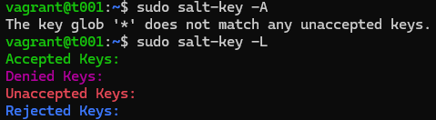

# Soitto kotiin

## Tiivistelmät
**Two Machine Virtual Network With Debian 11 Bullseye and Vagrant**  
- Vagrant käynnistää virtuaalikoneet automaattisesti, automatisoi SSH-kirjautumisen sekä toimii komentoriviltä
- Luodaan tiedosto `Vagrantfile`, johon määritellään kaksi konetta (t001 ja t002) omilla IP-osoitteilla
- Käynnistys `Vagrant up` ja yhdistys `vagrant ssh t001`

(Karvinen, 2021)

**Salt Quickstart – Salt Stack Master and Slave on Ubuntu Linux**  
- Salt mahdollistaa tuhansien koneiden hallinnan yhdeltä master-palvelimelta
- Slavet voivat sijaita missä tahansa
- Slaven asetuksissa määritetään masterin IP ja halutessa oma ID

(Karvinen, 2018)

**Salt Vagrant - automatically provision one master and two slaves**  KORJAA
- `init.sls`-tiedostoon määritellään yksittäinen tila
- `top.sls`-tiedostoon määritellään, mitä tiloja suoritetaan eri minioneilla

(Karvinen, 2023)

## Tehtäviä
### Käyttöympäristö
Intel Core i7-13700K, 3.40 GHz, 16 Core Processor   
RAM: 32 Gt   
Windows 11 Pro, versio 23H2  
Debian 12 Bookworm

### Hello Vagrant!
Asensin Vagrantin [oheissa](https://terokarvinen.com/2021/two-machine-virtual-network-with-debian-11-bullseye-and-vagrant/) olevasta [linkistä](https://developer.hashicorp.com/vagrant/install). Asennuksen aikana hyväksyin perusasetukset ja lopuksi käynnistin koneen uudestaan.  
Testasin asennuksen onnistumisen tarkistamalla Vagrantin version. Asennus oli onnistunut.  

### Linux Vagrant
Avasin Command Promptin ja loin kansion nimeltä `twohost`. Siirryin kansioon ja loin Vagrantfilen.

    $ mkdir twohost
    $ cd twohost
    $ vagrant init debian/bookworm64

Seuraavaksi käynnistin virtuaalikoneen komennolla `$ vagrant up`.  

Kävin kurkkaamassa VirtualBoxista, näkyykö siellä uusi virtuaalikone. Näkyyhän siellä ja vielä käynnissä.  

Seuraavaksi yhdistin virtuaalikoneeseen ja tarkistin toimivuuden tutkimalla käyttöajan

    $ vagrant ssh
    $ uptime

Suljin yhteyden ja poistin virtuaalikoneen.

    $ exit
    $ vagrant destroy

### Kaksin kaunihimpi

Muokkasin aiemmassa kohdassa luotua `Vagrantfile`-tiedostoa ja lisäsin sinne Teron [ohjeista](https://terokarvinen.com/2021/two-machine-virtual-network-with-debian-11-bullseye-and-vagrant/) konfiguroinnit. Vaihdoin virtuaalikoneen tiedot oikein.  
Tämän jälkeen tallensin tiedoston.

Seuraavaksi siirryin takaisin Command Promptiin ja käynnistin Vagrantin komennolla `$ vagrant up`.  
Kesti hetken, kunnes näin VirtualBoxissa kummatkin virtuaalikoneet.  

Sitten yhdistin virtuaalikoneeseen `t001` ja koitin pingata koneeseen `t002`.   

    $ vagrant ssh t001
    $ ping 192.168.88.102

Unohdin tässä kohtaa merkata, kuinka monta kertaa ping-komento lähetetään.

Suljin ssh yhteyden komennolla `$ exit`.  
Seuraavaksi yhdistin virtuaalikoneeseen `t002` ja pingasin koneeseen `t001` kaksi kertaa.  

    $ vagrant ssh t002
    $ ping -c 2 192.168.88.101

Hyvin onnistui pingaukset.  
Lopuksi suljin ssh yhteyden komennolla `$ exit`.  

### Herra-orja verkossa
Muodostin yhteyden 'master' virtuaalikoneeseen `t001`. Suoritin ensiksi päivityksen ja asensin `curlin` Salt Projectin asennusta varten.  

    $ sudo apt-get update
    $ sudo apt-get install curl
    

Tämän jälkeen asesin Salt Projectin [ohjeiden](https://docs.saltproject.io/salt/install-guide/en/latest/topics/install-by-operating-system/linux-deb.html) mukaisesti.   

    $ mkdir -p /etc/apt/keyrings
    $ curl -fsSL https://packages.broadcom.com/artifactory/api/security/keypair/SaltProjectKey/public | sudo tee /etc/apt/keyrings/salt-archive-keyring.pgp
    $ curl -fsSL https://github.com/saltstack/salt-install-guide/releases/latest/download/salt.sources | sudo tee /etc/apt/sources.list.d/salt.sources
    
Seuraavaksi latasin virtuaalikoneelle `t001` salt-masterin ja tarkistin sen IP-osoitteen.  

    $ sudo apt-get update
    $ sudo apt-get -y install salt-master
    $ hostname -I

Sitten olikin aika siirtyä 'slave' virtuaalikoneelle `t002` ja suorittaa myös Salt Projectin asennus. 

    $ exit
    $ vagrant ssh t002
    ...Salt Projectin asennus

Tämän jälkeen asensin salt-minionin. Lisäsin myös masterin IP-osoitteen ja slavelle nimen tiedoston loppuun. Otin muutokset käyttöön käynnistämällä salt-minionin uudelleen.  

    $ sudo apt-get update
    $ sudo apt-get -y install salt-minion
    $ sudoedit /etc/salt/minion
    $ sudo systemctl restart salt-minion.service

Siirryin 'masterille' `t001` ja yritin hyväksyä `salt-keyn` komennolla `$ sudo salt-key -A`. Sain tästä vain herjauksen `The key glob '*' does not match any unaccepted keys.`.  
Tarkistin avaiminen listauksen komennolla `$ sudo salt-key -L`, jos avain olisi vahingossa esimerkiksi hyväksytty jo. Lista oli tyhjä.  

Löysin [netistä](https://www.drupal.org/node/2008794) Vargrantin käyttöön komentoja. Pysäytin Vagrantin ja käynnistin sen uudelleen, mutta muutosta ei tullut.  

    $ vagrant halt
    $ vagrant up

Kävin 'slavella' tarkistamassa, onko 'masterin' tiedot merkattu oikein tiedostoon ja ymmärrykseni mukaan oli. 
En löytänyt netistä kunnolla apua tähän, joten kysyin ChatGPT:ltä vinkkejä. Siirryin takaisin 'masterille' ja tarkistin onko `salt-master` käynnissä.

    $ sudo systemctl status salt-master

Seuraavaksi siirryin takaisin 'slavelle' ja koitin pingata 'masteria' kummallakin IP-osoitteella. Kummatkin yhdisti.  

    $ ping -c 2 192.168.88.101
    $ ping -c 2 10.0.2.15
    

Päädyin muokkaamaan 'masterin' IP-osoitteeksi `192.168.88.101` ja käynnistin `salt-minionin` uudelleen.  

    $ sudoedit /etc/salt/minion
    $ sudo systemctl status salt-master

Siirryin takaisin 'masterille' ja koitin uudelleen.  

    $ exit
    $ vagrant ssh t001
    $ sudo salt-key -A

Tämän jälkeen avain näkyi ja pääsin hyväksymään sen.  

Testasin vielä toimiiko 'slaven' komennus.  

    $ sudo salt '*' cmd.run 'whoami'

### Tilojen testaus verkon yli
Tässä käytetään viisikon `service`-tilaa. Tarkistaa salt-minionin palvelun tilan.

    $ sudo salt '*' service.status salt-minion

Seuraavassa komennossa käytetään taas viisikon `file`-tilaa. Se luo slavelle tiedoston nimeltä `heippa`.

    $ sudo salt '*' state.single file.managed /tmp/heippa

Aikaa näihin tiivistelmiin ja tehtäviin meni yhteensä noin 6h.  

## Lähteet
Karvinen, T. 2025. Tehtävänanto. https://terokarvinen.com/palvelinten-hallinta/#h2-soitto-kotiin.  
Karvinen, T. 11.4.2021. Two Machine Virtual Network With Debian 11 Bullseye and Vagrant. https://terokarvinen.com/2021/two-machine-virtual-network-with-debian-11-bullseye-and-vagrant/.  
Karvinen, T. 28.3.2018. Salt Quickstart – Salt Stack Master and Slave on Ubuntu Linux. https://terokarvinen.com/2018/salt-quickstart-salt-stack-master-and-slave-on-ubuntu-linux/?fromSearch=salt%20quickstart%20salt%20stack%20master%20and%20slave%20on%20ubuntu%20linux.  
Karvinen, T. 28.3.2023. Salt Vagrant - automatically provision one master and two slaves. https://terokarvinen.com/2023/salt-vagrant/#infra-as-code---your-wishes-as-a-text-file.  
Ubuntu. 2019. s.a. https://manpages.ubuntu.com/manpages/jammy/man1/salt-key.1.html.  
Drupal. s.a. Basic Vagrant Usage. https://www.drupal.org/node/2008794.  
OpenAI. ChatGPT. Versio 3.5. 2025. https://chat.openai.com/chat.  
