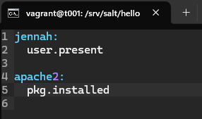

# Infraa koodina

## Tiivistelmät
**Hello Salt Infra-as-Code**
- Saltin avulla voidaan hallita monia koneita samanaikaisesti
- luodaan moduulikansio `/srv/salt/hello` ja tiedosto `init.sls?`
- `init.sls` sisältää ohjeen luoda tiedosto `/tmp/hellotero`
- komennon ajo `$ sudo salt-call --local state.apply hello` -> luo tiedoston ja raportoi muutokset
- tarkistus komennolla `$ ls /tmp/hellotero`

(Karvinen, 2024)  

**Salt overview**
- Rules of YAML
  - käytetään `avain: arvo` -pareja, erottimena kaksoispiste ja yksi välilyönti
  - vain välilyönnit sallittuja (ei tab)
  - kaikki avaimet ja ominaisuudet ovat case-sensitive
- YAML simple structure
  - Scalars: `key: value` - yksinkertaisia arvoja kuten merkkijonot, numerot, booleanit
  - Lists: `key: ` - jonka jälkeen arvot alkavat `-` merkillä ja sisennettynä
  - Dictionaries: `key: value` -pareja, voivat sisältää listoja tai toisia sanakirjoja
- Lists and dictionaries - YAML block structures
  - sisennys määrittää rakenteen (yleensä 2 välilyöntiä)
  - listat ja sanakirjat muodostavat lohkoja
  - listan jokainen arvo aloitetaan `-` merkillä ja välilyönnillä

(VMware, 2021 - 2024)  

## Tehtäviä
### Käyttöympäristö
Intel Core i7-13700K, 3.40 GHz, 16 Core Processor   
RAM: 32 Gt   
Windows 11 Pro, versio 23H2  
Debian 12 Bookworm

### Hei infrakoodi!
Käytin tässä tehtävässä viime kerralla luotuja virtuaalikoneita `t001` ja `t002` sekä seurasin Teron laatimia [ohjeita](https://terokarvinen.com/2024/hello-salt-infra-as-code/).
Aloitin tehävän avaamalla Command Promtin ja siirtymällä hakemistoon `/twohost`, jonka jälkeen käynnistin Vagrantin.  

    $ vagrant up

Tämän jälkeen menikin hetki, että Vagrant käynnistyy.  
Käynnistymisen jälkeen avasin virtuaalikoneen `t002` ja testasin samalla pingata koneeseen `t001`.

    $ vagrant ssh t001
    $ ping -c 2 192.168.88.101

Salt-minion asennus olikin koneessa jo valmiiksi, joten tein vain päivityksen sekä latasin micro-editori ja asetin sen oletueditoriksi.  

    $ sudo apt-get update
    $ sudo apt-get -y install micro
    $ export EDITOR=micro

Seuraavaksi loin kansion `hello` -moduulille, siirryin sinne ja loin `init.sls` tiedoston.  
`-p` -valitsin komennossa `mkdir -p` tarkoittaakin, että se luo alihakemiston, jos niitä ei ole jo olemassa (Super User, 2010). 

    $ sudo mkdir -p /srv/salt/hello/
    $ cd /srv/salt/hello/
    $ sudoedit init.sls

Lisäsin tiedostoon impodenttia koodia.  

Sitten pääsin ajamaan koodin paikallisesti ja katsomaan onnistuiko yritys.  

    $ sudo salt-call --local state.apply hello

Toimihan se! Seuraavaksi testasin, onko koodi impodentti ajamalla komennon uudestaan.  

Kyllähän se oli. Tämän saa pääteltyä siitä, että kohdan "Succeeded: 1" perässä ei ole muutosilmoitusta.  
Tarkistetaan vielä, onko tiedosto oikeasti olemassa.  

    $ ls /tmp/hellojenna

Kyllähän se oli.  

(Karvinen, 2024)  

### Tiedoston jakaminen verkon yli orjalla

Vaihdoin 'master' koneelle `t001`. Tässä aloinkin epäilemään, että oliko aiempi kohta pitänyt toteuttaa 'masterilla'?  
Aloitin tarkastamalla master-slave yhteyden.  

    $ sudo salt-key -L

Kaikki kunnossa.  
Seuraavaksi loin samat hässäkät kuin aikaisemmassa kohdassa, ainoana erona `init.sls` -tiedostoon laitoin tulevan tiedoston nimen hieman erillaiseksi.  

 Sitten olikin aika luoda tiedosto komennon avulla 'slave' koneelle.  

    $ sudo salt '*' state.apply hello

 

Näytti onnistuneen.  
Käydään vielä 'slavella' tarkistamassa, onko tiedosto oikeasti luotu.  

 

Jes, siellähän se!  

### sls-tiedosto kahdella eri tilafunktiolla
Aloitin taas siirtymällä 'master' koneelle `t001`.  
Lähdin muokkaamaan aiemassa kohdassa tehtä `init.sls` -tiedostoa.  
Lisäsin tiedostoon tilafunktiot `user.present` mikä luo uuden käyttäjän `jennah` ellei sitä jo ole olemassa sekä  `pkg.installed` mikä asentaa koneelle `apache2`, jos sitä ei ole jo asennettuna.  

 

Seuraavaksi ajoin `sls` -tiedoston.  

    $ sudo salt '*' state.apply hello 

 

Jahas, sieltähän tuli virhe, mikä osoittaa `apache2` riviä.  
Tuolla kyseisellä rivillä on vahingossa tullut välilyönti eteen. Siirryin tiedostoon ja muokkasin virheen eli poistin ylimääräiset välilyönnit.  

 

Tämän jälkeen koitin ajaa komennon uudestaan.   

    $ sudo salt '*' state.apply hello 

   
   
 

Sehän onnistui. Testataan vielä onko koodi impodentti syöttämällä komento uudestaan.   

 

Impodenttihan se siellä!  
Käydään vielä 'slave' koneella tarkistamassa todellinen tilanne.  
Käytin testaamisessa komentoja `$ getent passwd jennah` ja `whereis apache2`.  

 

Sieltähän ne löytyi.  

## Lähteet
Karvinen, T. 2025. Tehtävänanto. https://terokarvinen.com/palvelinten-hallinta/#h3-infraa-koodina.  
Karvinen, T. 3.4.2024. Hello Salt Infra-as-Code. https://terokarvinen.com/2024/hello-salt-infra-as-code/.  
VMware. 2021 - 2024. Salt overview. https://docs.saltproject.io/salt/user-guide/en/latest/topics/overview.html#rules-of-yaml.  
Hostinger. 28.3.2025. Linux list users: How to display all users in the terminal?. https://www.hostinger.com/tutorials/how-to-list-users-in-linux.  
Super User. 19.7.2010. What does the -p flag do in "mkdir -p"?. https://superuser.com/questions/165157/what-does-the-p-flag-do-in-mkdir-p.  
