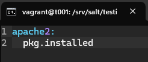

# Pkg-file-service

## Tiivistelmät
**Pkg-File-Service – Control Daemons with Salt – Change SSH Server Port**
- **pkg-file-service:** asenna ohjelma, hallitse asetustiedostoa, varmista palvelun käynnissäolo
- moduuli asennetaan yhteen kansioon, jotta sitä on helpompi hallita
- Portti vaihdetaan konfiguraatiotiedostossa
  - Vagranttia käyttäessä muistetaan jättää `Port 22` auki
- Testaus `nc`- tai `ssh -p`- komennolla

(Karvinen, 2018)

## Tehtäviä
### Käyttöympäristö
Intel Core i7-13700K, 3.40 GHz, 16 Core Processor   
RAM: 32 Gt   
Windows 11 Pro, versio 23H2  
Debian 12 Bookworm

### a) Apache easy mode
Aloitin tehtävän siirtymällä Command Promtilla hakemistoon `/twohost` ja käynnistin Vagrantin. Käynnistymiseen meni hetki, jonka jälkeen yhdistin virtuaalikoneeseen `t001`.  

    $ vagrant up
    $ vagrant ssh t001

Yhdistämisen jälkeen tein päivitykset ja asensin `apache2` -palvelinohjelman.

    $ sudo apt-get update
    $ sudo apt-get -y install apache2

Sitten testasin Apachen toimivuuden.  

    $ curl http://localhost

Toimii!  

Seuraavaksi korvasin oletussivun `echo` komennolla ja tarkistin tuotoksen `curl` komennolla.    

    $ echo "Testi" | sudo tee /var/www/html/index.html
    $ curl http://localhost

Näyttää toimivan.  
Sitten olikin vuoro automatisoida asennus. Loin `/srv/salt/` hakemistoon uuden `testi` -moduulin. Siirryin sinne ja loin `init.sls` -tiedoston.  
Lisäsin sinne yhden tilamuuttujan `pkg.installed`.  

    $ sudo mkdir -p /srv/salt/testi/
    $ cd /srv/salt/testi/
    $ micro init.sls

Testasin tämän paikallisesti.  

    $ sudo salt-call --local state.apply testi

Onnistuihan se, vaikka muutoksia ei tullut, koska apache oli valmiiksi asennettuna.  

Lähdin muokkaamaan `init.sls` -tiedostoa lisää, jotta saan oletussivun korvattua.  

Loin myös moduuliin `index.html` -tiedoston, millä apachen oletussivu korvataan.  

Tämän jälkeen ajoin tiedoston paikallisesti.  

    $ sudo salt-call --local state.apply testi

Jahas, vissiin samaa tilan nimeä ei voi käyttää kahdesti. Korjataan asia ja koitetaan uudelleen.  
Vaihdoin tässä rivin 8 `apache2 -> apache2-service`.  

Tässä hetken mietiskelin, että missä virhe. Kirjoitusvirhehän se rivillä 4 `index.thml -> index.html`.  Korjataan ja koitetaan uudelleen.  

Nyt jäi hämmentämään. Tätä pääsin taas mietiskelemään ja lähdin vertaamaan `init.sls` -tiedoston sisältöä Teron [ohjeisiin](https://terokarvinen.com/2018/04/03/pkg-file-service-control-daemons-with-salt-change-ssh-server-port/?fromSearch=karvinen%20salt%20ssh). Koitin sitten muokata `-` merkit `source`, `name` ja `enable` eteen.  Testataan.  

  

Läpi meni!  
Testataan vielä `curl` -komentoa `localhostiin`.  

Jes.  

### b) SSHouto
Seurasin tässä tehtävässä Teron laatimia [ohjeita](https://terokarvinen.com/2018/04/03/pkg-file-service-control-daemons-with-salt-change-ssh-server-port/). Poiketen oheista, tehtävänannossa oli suositus tehdä tälle oma moduuli, joten aloitin luomalla sellaisen. Siirryin hakemistoon ja muokkasin `init.sls` -tiedostoa ohjeen mukaisesti. Ainoana muokkauksena: `source: salt://ssh/sshd_config`.  

    $ sudo mkdir -p /srv/salt/ssh/
    $ cd /srv/salt/ssh/
    $ micro init.sls
    
    

Seuraavaksi loin `ssh` -moduuliin `sshd_config` -tiedoston ja kopioin sisällön ohjeista, mutta lisäsin `Port 22` -aukon.  

    $ micro sshd_config

Sitten ajoin moduulin paikallisesti.  

    $ sudo salt-call --local state.apply ssh

  

Näyttää positiiviselta.  
Testasin vielä porttia `8888`.  
Tässä `netcat` -komennossa `-v` (verbose) tulostaa tiedon onnistumisesta sekä `-z` (zero-I/O mode) tarkistaa, onko portti auki.  

    $ nc -vz localhost 8888

Yritin vielä muodostaa ssh-yhteyden localhostiin.  

    $ ssh -p 8888 vagrant@localhost

Onnistui vissiinkin, mutta salasanaa ei ole tiedossa eikä olemassa.  

(Karvinen, 2018)

## Lähteet
Karvinen, T. 2025. Tehtävänanto. https://terokarvinen.com/palvelinten-hallinta/#h4-pkg-file-service.  
Karvinen, T. 3.4.2018. Pkg-File-Service – Control Daemons with Salt – Change SSH Server Port. https://terokarvinen.com/2018/04/03/pkg-file-service-control-daemons-with-salt-change-ssh-server-port/.  
IONOS. 10.2.2020. What is Netcat? https://www.ionos.com/digitalguide/server/tools/netcat/.  
