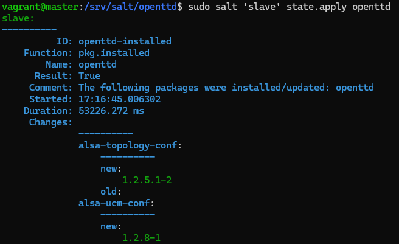
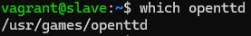

# Miniprojekti

### Käyttöympäristö
Intel Core i7-13700K, 3.40 GHz, 16 Core Processor   
RAM: 32 Gt   
Windows 11 Pro, versio 23H2  
Debian 12 Bookworm

## a) Oma miniprojekti
Aluksi pääsin miettimään aihetta. Päädyin peliaiheiseen projektiin, jossa tarkoituksena olisi automatisoida [OpenTTD](https://www.openttd.org/) (Transport Tycoon Deluxe) asennus Saltin avulla.   
Myöhemmin tämä sitten vaihtui terminaalissa pelattavien pelien asennukseksi  ja "valikkosovellukseksi", sillä se on esitystilanteessa selkeämpi ja helpompi demonstroida.  
Valikko tarjoaa käyttäjälle helpon tavan valita ja käynnistää useita terminaalissa pelattavia pelejä. Käyttäjä voi valita pelin numeronäppäimillä, ja peli käynnistyy suoraan valinnan jälkeen.   

### Master ja Slave
Aloitin projektin pystyttämällä Vagrantilla Master ja Slave koneet.

    $ mkdir gameproject
    $ cd gameproject
    $ notepad Vagrantfile

```
# Master skripti -> saltin asennus
$master_script = <<MASTER_SCRIPT
set -o verbose
sudo apt-get update
sudo apt-get install -y curl tree
sudo mkdir -p /etc/apt/keyrings
sudo curl -fsSL https://packages.broadcom.com/artifactory/api/security/keypair/SaltProjectKey/public | sudo tee /etc/apt/keyrings/salt-archive-keyring.pgp
sudo curl -fsSL https://github.com/saltstack/salt-install-guide/releases/latest/download/salt.sources | sudo tee /etc/apt/sources.list.d/salt.sources
sudo apt-get update
sudo apt-get install -y salt-master
sudo systemctl restart salt-master.service
MASTER_SCRIPT

# Minion skripti-> saltin asennus ja yhdistäminen Masteriin
$minion_script = <<MINION_SCRIPT
set -o verbose
sudo apt-get update
sudo apt-get install -y curl tree
sudo mkdir -p /etc/apt/keyrings
sudo curl -fsSL https://packages.broadcom.com/artifactory/api/security/keypair/SaltProjectKey/public | sudo tee /etc/apt/keyrings/salt-archive-keyring.pgp
sudo curl -fsSL https://github.com/saltstack/salt-install-guide/releases/latest/download/salt.sources | sudo tee /etc/apt/sources.list.d/salt.sources
sudo apt-get update
sudo apt-get install -y salt-minion
echo -e 'master: 192.168.12.101' |sudo tee /etc/salt/minion
sudo systemctl restart salt-minion.service
MINION_SCRIPT

# Vagrant pääkonfiguraatio
Vagrant.configure("2") do |config|
  config.vm.box = "debian/bookworm64"

  # Master
  config.vm.define "master" do |master|
    master.vm.hostname = "master"
    master.vm.network "private_network", ip: "192.168.12.101"
    master.vm.synced_folder "salt/", "/srv/salt", owner: "root", group: "root"
    master.vm.provision "shell", inline: $master_script
  end

  # Slave (minion)
  config.vm.define "slave", primary: true do |slave|
    slave.vm.hostname = "slave"
    slave.vm.network "private_network", ip: "192.168.12.102"
    slave.vm.provision "shell", inline: $minion_script
  end
end

```

Seuraavaksi käynnistin lisäsin kansioon vielä `salt` nimisen jaetun kansion komennolla `$ mkdir salt`.  
Sitten käynnistin Vagrantin komennolla `$ vagrant up`.   


Ei ihan onnistunut. Tiedostoa ei vissiinkään löytynyt.  
Kävin tarkistamassa tilanteen komennolla `$ dir`.   
Tiedostoa ei löytynyt, koska sen nimessä oli `.txt` pääte. Muokkasin nimen `Vagrantfile.txt -> Vagranfile` komennolla `rename Vagrantfile.txt Vagrantfile`.  
Sitten heitin komennon `$ vagrant up` uudestaan. Nyt lähti toimimaan!  

Hetken aikaa meni ja kävin tarkistamassa VirtualBoxista, että koneet käynnistyivät.  


Siellähän ne oli!  
  
Seuraavaksi siirryin ssh yhteydellä master-virtuaalikoneeseen ja testasin toimivuuden tutkimalla sen käyttöaikaa. Testasin myös pingata slave-konetta.  

    $ vagrant ssh master
    $ uptime
    $ ping -c 2 192.168.12.102

  


Tämän jälkeen hyväksyin `salt-keyn` ja testasin toimiiko `slaven` komennus.  

    $ sudo salt-key -L
    $ sudo salt-key -A
    $ sudo salt '*' cmd.run 'whoami'
    
  

Toimii hyvin.  

### Lokaali testaus
Siirryin ssh yhteydellä Master koneelle ja asensin micro-editorin.

    $ sudo apt-get -y install micro
    $ export EDITOR=micro

Seuraavaksi loin kansion `nskane`, siirryin sinne ja loin `init.sls` tiedoston.  

    $ sudo mkdir -p /srv/salt/openttd/
    $ cd /srv/salt/openttd/
    $ sudo micro init.sls

  

Sitten koitin ajaa koodin paikallisesti.   

    $ sudo salt-call --local state.apply openttd

 

Netistä en löytänyt tälle selitystä, mutta sain tekoälyltä vastauksen, että virtuaalikoneelta on muisti loppu.  
Suljinkin tämän jälkeen ssh-yhteyden ja kävin muokkaamassa `Vagrantfile` -tiedostoon lisää muistia.  
Lisäsin Masterin määrittelyyn:  

```
master.vm.provider "virtualbox" do |vb|
  vb.memory = 1024  # tai 2048 jos mahdollista
end
```
Ja tässä Master kokonaisuudessaan:  
```
# Master
  config.vm.define "master" do |master|
    master.vm.hostname = "master"
    master.vm.network "private_network", ip: "192.168.12.101"
    master.vm.synced_folder "salt/", "/srv/salt", owner: "root", group: "root"
    master.vm.provision "shell", inline: $master_script

    master.vm.provider "virtualbox" do |vb|
      vb.memory = 2048
  end
```

Muokkauksen jälkeen käynnistin koneet uudelleen komennolla `$ vagrant reload`.  
Tämän jälkeen siirryin takaisin Masterille ja hakemistoon `/srv/salt/openttd/` ja koitin ajaa tämän uudestaan paikallisesti.  

   
  

Tällä kertaa se onnistui.  

### Minionilla ajo
Seuraavaksi testasin ajaa tämän Masterin kautta Slavelle.

    $ sudo salt 'slave' state.apply openttd

  
  

Näytti onnistuneen.  
Siirryin vielä ssh-yhetydellä Slave koneelle tarkistamaan, että oliko lataus onnistunut komennolla `which openttd`.  

  

Näyttäisi onnistuneen.  

### Aiheen muutos

Älysin tässä vaiheessa, että en pysty kunnolla näyttämään tämän toimintaa, sillä graafista käyttöliittymää en saa auki.  
Päädyin vaihtamaan terminaalissa toimivaan matopeliin `nsnake`. Tein tähän uuden kansion hakemistoon `/srv/salt/nsnake/`, sinne loin uuden `init.sls` tiedoston.  

  

Testasin ajaa tämän myös lokaalisti ja testaa sen toimivuuden käynnistämällä pelin.  

    $ sudo salt-call --local state.apply nsnake
    $ nsnake

   
  

Sitten vielä testataan ajo Saltin avulla Slavelle. 

    $ sudo salt 'slave' state.apply nsnake
    
  

Onnistui.  

### Valikko ja lisää pelejä
Lähdin muokkaamaan `init.sls` -tiedostoa ja lisäsin sinne asennukset myös `nudoku`- ja `pacman4console`-peleille. Lisäsin myös pelivalikolle skriptin.  

  

Valikon `mode: 755` kertoo käyttöoikeuksista. `755` vastaa samaa kuin `rwxr-xr-x` eli omistaja voi lukea, kirjoittaa ja suorittaa, kun muut voivat lukea ja suorittaa. (Ludosanu, 2023)   

Seuraavaksi loin kansion valikon skriptille, siirryin kansioon ja loin tiedoston `play-terminal-games`.    

    $ sudo mkdir -p /srv/salt/nsnake/files/
    $ cd files/
    $ sudo micro play-terminal-games.sh

Pyysin tekoälyä luomaan simppelin bash-skriptin valikolle. Sain sieltä tällaisen ja päätin käyttää sitä:

  

Suoritin tämän taas ekaksi lokaalisti ja koitin käynnistää valikon.  

    $ sudo salt-call --local state.apply nsnake
    $ play-terminal-games

  

Tässä kohtaa en kerennyt tallentamaan kuvaa onnistuneesta skriptin ajosta, mutta valikko ja peli toimi hyvin.  

Sitten koitin ajaa Saltin avulla Slavelle.  

    $ sudo salt 'slave' state.apply nsnake

 

Onnistui.  
Kävin myös Slavella testaamassa toiminnan, hyvin toimi.  

 

### Testaus tyhjiin koneisiin
Poistin virtuaalikoneet ja loin uudet.

    $ vagrant destroy
    $ vagrant up

Sitten siirryin ssh-yhteydellä Masterille ja hyväksyin Slaven avaimen.  

    $ sudo salt-key -L
    $ sudo salt-key -A

Sitten koitin ajaa lokaalisti ja sen jälkeen myös Saltin avulla Slavelle.  
Kävin Slavella tarkistaa toimivuuden.  

 

Tämän jälkeen tyhjensin taas virtuaalikoneet komennolla `vagrant destroy`.  

### Pelaajan ja pistetaulukon lisäys
Päädyin vielä lisäämään tähän pelaajavalinnan sekä pistetaulukon.  
Siirryin `nsnake` hakemistoon ja lähdin muokkaamaan `init.sls` -tiedostoa. Lisäsin sinne tilan `create-highscores`, jonka avulla luodaan myös suoraan päälaitteessa ajettava `highscores` komento. 

        $ cd /srv/salt/nsnake/
        $ sudo micro init.sls

  

Seuraavaksi siirryin `/files/` hakemistoon ja muokkasin aiemmin luotua `play-terminal-games.sh` -tiedostoa.  
Lisäsin sinne tyylikkäämmän ja aiheeseen sopivamman otsikon sekä kohdan, missä `read` komennolla kysytään pelaajan nimeä. `-p` -promti tässä kohtaa näyttää kysymyksen (Dancuk, 2022).  
Lisäyksenä tuli myös `highscores` -valinta.  

        $ cd files/
        $ notepad play-terminal-games.sh

  

Sitten olikin aika luoda bash-skripti pistetaulukolle.

        $ sudo micro highscores.sh

  

Tämän jälkeen olikin aika testaa tämä lokaalisti.  

        $ sudo salt-call --local state.apply nsnake

  

Ajo onnistui ja seuraavaksi ajan sen Saltin avulla Slavelle.  
Ennen tätä, hyväksyin Slaven avaimen.  

        $ sudo salt-key -L
        $ sudo salt-key -A
        $ sudo salt 'slave' state.apply nsnake

  

Kävin vielä tarkistamassa toimivuuden Slavella.  

        $ vagrant ssh slave
        $ play-terminal-games

 

Näyttää toimivan. Pistetaulukko onkin tyhjänä, koska pelejä ei vielä ole pelattu.  
Testasin pelaa peliä ja tarkistaa pistetaulukon toimivuuden. Ei ihan toiminut, olin unohtanut, että pisteet tulee tallettaa johonkin hakemistoon.  
Lähdin muokkaamaan `init.sls` tiedostoa ja lisäsin sinne `create-score-directory` -tilan.  

 

Sitten ajoin tämän uudestaan Slavelle ja testasin.  

 

Toimii näemmä.  

## b) Etusivu
Ensiksi loin uuden repositorion [gameproject](https://github.com/haksutin/gameproject) GitHubiin ja yhdistin gameproject kansion ssh avulla.   

Pushauksen aikana, jotain hämmentävää tapahtui ja en testikierroksella saanutkaan slavella komentoa `play-terminal-games` läpi, sain error viestin.  

        -bash: /usr/local/bin/play-terminal-games: cannot execute: required file not found
        vagrant@slave:~$ file /usr/local/bin/play-terminal-games
        /usr/local/bin/play-terminal-games: Bourne-Again shell script, ASCII text executable, with CRLF line terminators

Tiedostot olivat kyllä paikallaan, mutta tiedostot sisältävät CRLF-rivinvaihtoja, joita Bash ei pysty käsittelemään.  
Tässä kohtaa kysyin neuvoa tekoälyltä ja sain suhteellisen helpon ratkaisun. Päätin automatisoida sen `init.sls` tiedostoon.  
Lisäyksiä ovat `dos2unix` työkalun asennus sekä rivinvaihtojen korjaukset.  

 

Testasin uudelleen tämän tyhjälle virtuaalikoneelle ja toimi! Hyvä homma.  


## Lähteet
Karvinen, T. 2025. Tehtävänanto. https://terokarvinen.com/palvelinten-hallinta/#h5-miniprojekti.  
Karvinen, T. 28.3.2023. Salt Vagrant - automatically provision one master and two slaves. https://terokarvinen.com/2023/salt-vagrant/#infra-as-code---your-wishes-as-a-text-file.   
OpenTTD. 2025. https://www.openttd.org/.  
Abhishek P. 25.3.2023. It's FOSS. Top 10 Command Line Games for Linux. https://itsfoss.com/best-command-line-games-linux/.  
Ludosanu, R. 3.8.2023. Chmod 755. https://www.warp.dev/terminus/chmod-755.  
OpenAI. ChatGPT. Versio 4o. 2025. https://chat.openai.com/chat.  
Dancuk, M. 21.2.2022. How To Use The Bash read Command. https://phoenixnap.com/kb/bash-read.  
